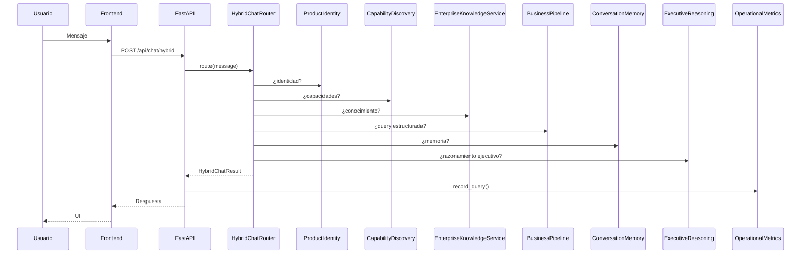

# Arquitectura — Olnatura Intelligence RC1

**Versión:** 1.0.0-RC1  
**Fecha:** 2026-06-23

---

## Visión general

Olnatura Intelligence es una plataforma de asistencia empresarial con arquitectura en capas:

1. **Presentación** — React SPA (español, 16 pantallas)
2. **API** — FastAPI (99 endpoints, 29 routers)
3. **Orquestación** — Hybrid Chat Router
4. **Motores de negocio** — Pipeline, conocimiento, memoria, razonamiento
5. **Inteligencia ejecutiva** — FinOps, simulación, decisiones
6. **Datos** — PostgreSQL + datamart procesado

---

## Flujo principal (consulta de usuario)



---

## Capas de decisión y costos

```mermaid
flowchart LR
  OM[Operational Metrics] --> FinOps[/api/finops]
  OM --> SE[Simulation Engine]
  SE --> EDE[Enterprise Decision Engine]
  EKS[Enterprise Knowledge Service] --> EDE
  EKO[EKO] --> EDE
  ERO[ERO] --> EDE
  EEP[EEP] --> EDE
  FinOps --> EDE
  EDE --> EDP[Enterprise Decision Package]
```

---

## Fuentes únicas por dominio

| Dominio | Módulo canónico | Métricas |
|---------|-----------------|----------|
| Conocimiento runtime | `enterprise_knowledge_service` | `enterprise_knowledge_metrics` |
| FinOps | `operational_metrics` | `operational_finops_metrics` |
| Simulación | `simulation_engine` | `simulation_engine_metrics` |
| Decisiones | `enterprise_decision` | `enterprise_decision_metrics` |
| Observabilidad agregada | `observability/metrics_service` | `/api/metrics/summary` |

El endpoint `/api/metrics/summary` **agrega** snapshots de todos los módulos sin duplicar lógica de negocio.

---

## Dependencias entre módulos (simplificado)

```
main.py
├── hybrid_chat → services/hybrid_chat_router
│   ├── product_identity
│   ├── capability_discovery
│   ├── enterprise_knowledge_service (runtime)
│   ├── conversation_memory
│   ├── query_engine + query_executor + response_engine
│   ├── guided_fallback, slot_clarification, coverage_recovery
│   ├── semantic_intent
│   ├── ai_orchestration (executive reasoning)
│   └── operational_metrics (registro)
├── finops → operational_metrics
├── simulation → simulation_engine → operational_metrics
├── decision → enterprise_decision → [EKS, EKO, ERO, EEP, FinOps, Simulation]
├── enterprise_knowledge_service
├── business_knowledge (facade → EKS)
└── knowledge_pack (facade → EKS)
```

---

## Base de datos

| Esquema | Uso |
|---------|-----|
| `performance_metrics` | Latencias, routing, tokens |
| `operational_query_metrics` | FinOps por consulta |
| `enterprise_knowledge_objects` | EKO |
| `enterprise_reasoning_objects` | ERO |
| `evidence_packages` | EEP |
| Entidades / ontología | Catálogos empresariales |

---

## Frontend

- **Router:** React Router v6
- **i18n:** `frontend/src/i18n/spanish.ts` (catálogo único)
- **Estado:** Hooks por dominio (`useFinOps`, `useDecisionCenter`, etc.)
- **API:** Servicios en `frontend/src/services/`

---

## Observabilidad

| Señal | Dónde |
|-------|-------|
| Requests totales | `performance_metrics` (BD) |
| Costos por consulta | `operational_query_metrics` |
| Snapshots in-memory | Por módulo → agregados en `/api/metrics/summary` |
| Health | `/health`, `/api/finops/health`, health por módulo |

---

## Deuda arquitectónica documentada

1. Dos `DeterministicResponseEngine` (legacy vs v2)
2. Cuatro APIs de conocimiento
3. Chat legacy + hybrid coexistiendo
4. Métricas in-memory no persistidas
5. Sin capa de autenticación

Ver `docs/legacy_modules_rc1.md` y `docs/technical_debt_assessment.md`.

---

## Diagrama de despliegue (piloto)

```
[Usuario] → [Browser] → [Vite/Nginx static]
                              ↓
                        [FastAPI :8001]
                              ↓
                    [PostgreSQL :5432]
                              ↓
                    [Ollama :11434] (opcional)
```

---

## Referencias

- [`release_candidate_1.md`](release_candidate_1.md)
- [`api_catalog_rc1.md`](api_catalog_rc1.md)
- [`legacy_modules_rc1.md`](legacy_modules_rc1.md)
- [`security_audit_rc1.md`](security_audit_rc1.md)
