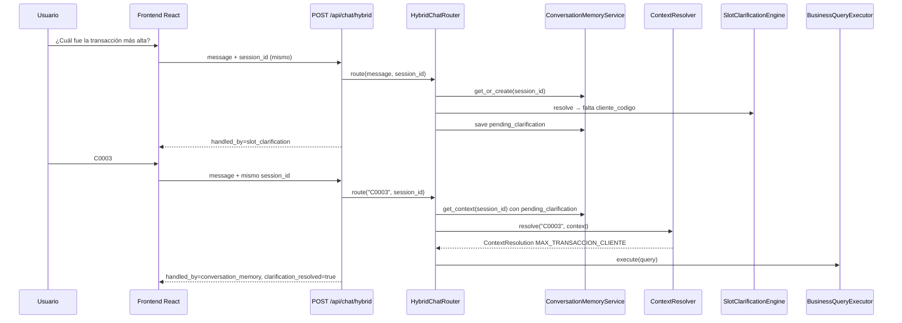
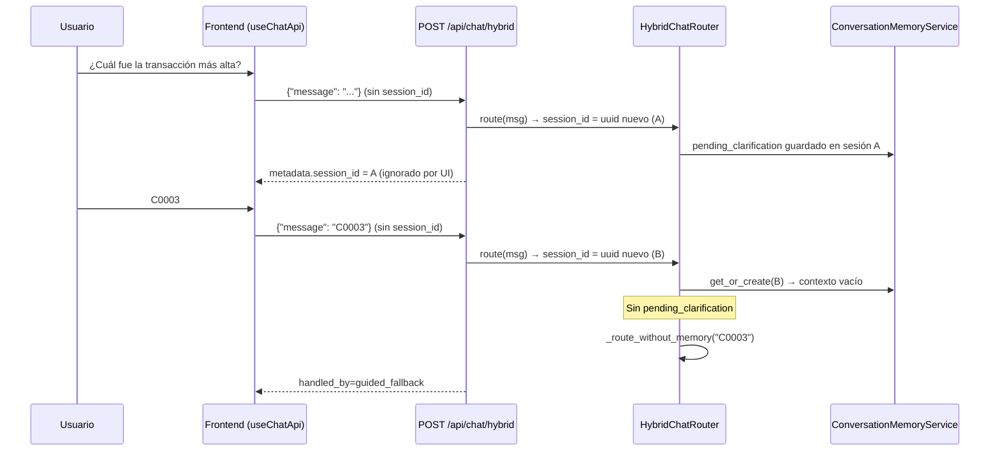

# Root Cause Analysis — Ruptura del flujo conversacional (Slot Clarification → Memory)

**Proyecto:** Asistente de Inteligencia Empresarial Olnatura  
**Fecha:** 2026-06-23  
**Modo:** Solo análisis — sin cambios en código, tests ni base de datos.

**Síntoma reportado:**

| Turno | Usuario | Sistema esperado | Sistema observado |
|-------|---------|------------------|-------------------|
| 1 | ¿Cuál fue la transacción más alta? | Slot clarification (`MAX_TRANSACCION_CLIENTE`) | ✓ Clarificación de cliente |
| 2 | C0003 | `conversation_memory` → ejecutar `MAX_TRANSACCION_CLIENTE` | ✗ Tratado como consulta nueva → Capability Discovery / Guided Fallback |

---

## 1. Flujo esperado



**Condición crítica:** el **mismo `session_id`** debe enviarse en todos los turnos de la conversación.

---

## 2. Flujo real (reproducido en pruebas)

### 2.1 Desde el frontend actual (producción UI)



### 2.2 Con `session_id` explícito (como en tests de integración)

Prueba ejecutada con `TestClient` el 2026-06-23:

| Caso | Turno 2 `handled_by` | `context_hit` | `clarification_resolved` |
|------|------------------------|---------------|--------------------------|
| **Con `session_id` fijo** | `conversation_memory` | `true` | `true` |
| **Sin `session_id`** (simula frontend) | `guided_fallback` | `null` | `null` |

---

## 3. Punto exacto donde se rompe el flujo

**Ubicación:** Entre el **primer y segundo turno**, en la capa **Frontend → API HTTP**.

| Capa | ¿Funciona? | Evidencia |
|------|------------|-----------|
| Slot Clarification (turno 1) | ✓ | `handled_by=slot_clarification`, `pending_query_type=MAX_TRANSACCION_CLIENTE` |
| Persistencia `pending_clarification` | ✓ (en servidor) | `_persist_slot_clarification()` + `save_context()` en `hybrid_chat_router.py` L499–512, L200–201 |
| **Envío de `session_id` (turno 2)** | **✗** | Frontend no envía; backend genera UUID nuevo L79 |
| ContextResolver con `C0003` | ✓ (si hay contexto) | `parse_slot_value("C0003")` coincide con `C\d+`; test unitario L48–67 |
| BusinessQueryExecutor | ✓ (si llega resolución) | `_handle_conversation_memory` llama executor L251 |

**La ruptura ocurre antes de que `HybridChatRouter.route()` pueda leer `pending_clarification`:** cada request del frontend crea una **sesión nueva** en `ConversationMemoryService`.

---

## FASE 1 — Diagrama completo Frontend → BusinessQueryExecutor

```
AssistantPage
  └─ useChatApi.submitQuestion(question)
       └─ sendChatQuestion(question)          [hooks/useChatApi.ts L51]
            └─ sendHybridChatQuestion(message)  [chatApi.ts L50-51]
                 └─ POST /api/chat/hybrid
                      body: { message } ONLY   ← sin session_id

hybrid_chat.py
  └─ hybrid_router.route(request.message, session_id=request.session_id)

HybridChatRouter.route()                         [hybrid_chat_router.py L78-143]
  1. session_id = session_id or uuid.uuid4().hex   [L79]
  2. context = get_or_create(session_id)           [L80]
  3. [opcional] limpiar pending si is_new_question [L89-91]
  4. ContextResolver.resolve(message, context)     [L94]  ← PRIMERO memoria
  5a. Si resolution → _handle_conversation_memory
        → QueryExecutor.execute(query)             [L251]
        → DeterministicResponseEngine.generate      [L260]
  5b. Si no → _route_without_memory                [L115-120]
        → SemanticIntentBuilder.build              [L160]
        → BusinessQueryPlanner.plan                [L169]
        → [capability_discovery | slot_clarification | business_pipeline | guided_fallback | legacy]
              business_pipeline → QueryExecutor      [L303]
```

**Orden en router:** **Conversation Memory se evalúa siempre antes** que Business Pipeline, Capability Discovery, Guided Fallback o Legacy.

---

## FASE 2 — Auditoría Frontend (`session_id`)

| Pregunta | Respuesta | Evidencia |
|----------|-----------|-----------|
| ¿Se genera `session_id`? | **No** | `grep session_id` en `frontend/src` → 0 coincidencias |
| ¿Dónde? | — | No implementado |
| ¿Cómo? | — | — |
| ¿Es persistente? | **No** | No hay `localStorage`/`sessionStorage` para sesión de chat |
| ¿Se reutiliza? | **No** | Cada `submitQuestion` llama API solo con `message` |

```50:51:frontend/src/services/chatApi.ts
export async function sendHybridChatQuestion(message: string): Promise<HybridChatResult> {
  return postJson<HybridChatResult>('/api/chat/hybrid', { message })
```

```33:51:frontend/src/hooks/useChatApi.ts
  const submitQuestion = useCallback(async (question: string) => {
    ...
      const response = await sendChatQuestion(trimmed)
```

El backend **sí devuelve** `metadata.session_id` en respuestas de clarificación (`_handle_slot_clarification` L348), pero el frontend **no lo lee ni reenvía**.

---

## FASE 3 — Auditoría Chat API

**Contrato backend** (`app/schemas/hybrid_chat.py`):

```python
message: str
session_id: str | None = None  # opcional
```

**Comportamiento real** (`hybrid_chat_router.py` L79):

```python
session_id = session_id or uuid.uuid4().hex
```

| Request | `session_id` en body | `session_id` efectivo |
|---------|----------------------|------------------------|
| Frontend actual | Ausente | **Nuevo UUID cada POST** |
| Tests integración | Presente y constante | Mismo entre turnos |
| Turno 1 sin id | Ausente | `20574836931b47df8a29036e919b4221` (ejemplo probe) |
| Turno 2 sin id | Ausente | `dcf2336e19bf47ab9059d1f1eb58b5a4` (distinto) |

---

## FASE 4 — Orden exacto en HybridChatRouter

En **cada** llamada a `route()`:

1. Resolver/crear `session_id`
2. Cargar `ConversationContext`
3. **Conversation Memory** (`ContextResolver.resolve`) — **siempre primero**
4. Si hit → ejecutar query vía memory handler (executor + response engine)
5. Si miss → `_route_without_memory`:
   - Intent → Planner
   - Capability Discovery (si detector textual)
   - Slot Clarification (si query soportada pero faltan slots)
   - Business Pipeline (si slots completos)
   - Guided Fallback (si UNSUPPORTED)
   - Legacy Chat (último recurso)

**Conversation Memory no compite con Business Pipeline en paralelo:** es una compuerta previa.

---

## FASE 5 — Conversation Memory al recibir "C0003"

### Con `session_id` correcto (sesión con clarificación previa)

| Campo | Valor |
|-------|-------|
| `pending_clarification` | `{ pending_query_type: MAX_TRANSACCION_CLIENTE, missing_slots: [cliente_codigo], ... }` |
| `session_id` | Mismo que turno 1 |
| `ConversationContext` | Existe en `_store[session_id]` |
| `context_hit` | `true` en metadata de respuesta |

### Sin `session_id` (frontend actual)

| Campo | Valor |
|-------|-------|
| `pending_clarification` | **`None`** (contexto nuevo) |
| `session_id` | UUID nuevo, distinto al turno 1 |
| `ConversationContext` | Vacío (`turn_count=0`) |
| `context_hit` | Ausente |

---

## FASE 6 — ContextResolver y "C0003"

`parse_slot_value` para `cliente_codigo` (`slot_value_parser.py` L24-26):

```python
_CLIENT_CODE_PATTERN = re.compile(r"^\s*C\d+\s*$", re.IGNORECASE)
```

| Entrada | ¿Reconocida? | Resultado |
|---------|--------------|-----------|
| `C0003` | **Sí** | `"C0003"` |
| `C001` | **Sí** | Test unitario confirma |
| `PUBLICO EN GENERAL` | **No** | `None` → no resuelve clarificación |

`ContextResolver` **solo procesa clarificación pendiente** si `context.pending_clarification` existe (L73-76). Sin contexto de sesión, `"C0003"` no activa ninguna rama.

---

## FASE 7 — Slot Clarification (`pending_query_type`)

| Etapa | Mecanismo |
|-------|-----------|
| **Generación** | `SlotClarificationEngine.resolve()` → `pending_query_type=MAX_TRANSACCION_CLIENTE` |
| **Almacenamiento** | `_persist_slot_clarification()` → `context.pending_clarification` dict |
| **Persistencia** | `ConversationMemoryService.save_context(session_id, context)` en memoria de proceso |
| **Recuperación** | `get_or_create(session_id)` en turno siguiente |
| **Consumo** | `ContextResolver._resolve_pending_clarification()` |

**Quién consume:** `HybridChatRouter` vía `ContextResolver` en el **inicio** del turno 2 — **solo si `session_id` coincide**.

---

## FASE 8 — Ejecución post-contexto

Cuando memory resuelve correctamente (`_handle_conversation_memory` L241-292):

1. `BusinessQueryExecutor.execute(query)` — **sí se llama** (L251)
2. `DeterministicResponseEngine.generate()` — **sí** (L260)
3. **No** pasa por `BusinessQueryPlanner` de nuevo (query ya construida en resolución)

Cuando falla sesión, `"C0003"` entra a `_route_without_memory` → intent/planner → probablemente `UNSUPPORTED` → **Guided Fallback** (confirmado en probe).

---

## FASE 9 — Observabilidad

### Señales cuando el flujo **funciona** (con `session_id`)

```json
{
  "handled_by": "conversation_memory",
  "metadata": {
    "query_type": "MAX_TRANSACCION_CLIENTE",
    "context_hit": true,
    "clarification_resolved": true,
    "resolution_type": "clarification",
    "context_hits": ">= 1",
    "clarification_resolutions": ">= 1",
    "session_id": "<mismo en ambos turnos>"
  }
}
```

### Señales cuando el flujo **se rompe** (sin `session_id`, turno 2)

```json
{
  "handled_by": "guided_fallback",
  "metadata": {
    "context_hit": null,
    "clarification_resolved": null,
    "session_id": "<UUID distinto al turno 1>"
  }
}
```

Métricas en `performance_metrics` reflejarían `handled_by=guided_fallback` en el segundo turno en lugar de `conversation_memory`.

---

## FASE 10 — Pruebas controladas (2026-06-23)

Ejecutadas con `TestClient` contra la app local (sin modificar código de producción).

### Caso A — ¿Cuál fue la transacción más alta? → C0003

| Variante | Turno 1 | Turno 2 `handled_by` | Resultado |
|----------|---------|----------------------|-----------|
| **A** con `session_id` | `slot_clarification` | `conversation_memory` | Flujo conversacional OK |
| **A'** sin `session_id` | `slot_clarification` | `guided_fallback` | **Reproduce el bug** |

### Caso B — → PUBLICO EN GENERAL (con `session_id`)

| Turno | `handled_by` | Notas |
|-------|--------------|-------|
| 1 | `slot_clarification` | OK |
| 2 | `guided_fallback` | Parser solo acepta códigos `C\d+`, no nombres |

### Caso C — ¿Qué proveedor tuvo más movimiento? → junio (con `session_id`)

| Turno | `handled_by` | Notas |
|-------|--------------|-------|
| 1 | `slot_clarification` | Pide mes |
| 2 | `conversation_memory` | `clarification_resolved=true`, ejecuta `MAX_PROVEEDOR_MES` |

### Caso D — ¿Qué pasó en junio? → ¿Y julio? (con `session_id`)

| Turno | `handled_by` | Notas |
|-------|--------------|-------|
| 1 | `guided_fallback` | Pregunta no mapeada a query soportada |
| 2 | `guided_fallback` | Sin `last_query_type` válido para follow-up |

**Tests automatizados existentes que confirman el diseño correcto:**

- `tests/test_conversation_memory.py::test_router_clarification_then_cliente_resolution` — pasa con `session_id` fijo
- `tests/integration/test_hybrid_chat_integration.py::test_integration_hybrid_conversation_memory_clarification_resolution` — pasa **solo** enviando `session_id` en ambos POST

---

## FASE 11 — Hipótesis clasificadas

| Componente | ¿Es la causa del bug C0003? | Evidencia |
|------------|----------------------------|-----------|
| **Frontend** | **SÍ — causa raíz** | No envía `session_id`; backend crea sesión nueva cada turno |
| Conversation Memory | No (funciona con sesión) | Tests + probe con `session_id` |
| Context Resolver | No para `C0003` | Parser acepta `C0003`; unit tests OK |
| Slot Clarification | No | Turno 1 correcto; pending guardado en servidor |
| Planner | No | No alcanzado en turno 2 cuando memoria falla |
| Executor | No (flujo) | Se invoca cuando memory resuelve |
| Hybrid Router | No (lógica) | Orden correcto; depende de `session_id` |
| **Arquitectura API** | Parcial | Contrato documenta `session_id` opcional; responsabilidad del cliente no cumplida |

**Causa secundaria (Caso B):** `slot_value_parser` — **implementación** limitada a códigos `C\d+`, no nombres de cliente como "PUBLICO EN GENERAL".

---

## 4. Impacto

| Área | Impacto |
|------|---------|
| Usuarios reales vía React | **Todas** las clarificaciones de slot quedan rotas tras el primer turno |
| Tests backend | Pasan porque **siempre** envían `session_id` en integración |
| Desalineación QA vs producción | Alta — pruebas no reflejan comportamiento del frontend |
| Métricas | Infla `guided_fallback` / `context_misses` en escenarios que deberían ser `conversation_memory` |
| Multi-worker | Riesgo adicional futuro: memoria in-process no compartida entre workers |

---

## 5. Propuesta de solución (NO implementada)

### 5.1 Corrección principal (Frontend)

1. Generar `session_id` al iniciar conversación (UUID v4).
2. Persistir en `sessionStorage` o estado React de `AssistantPage`.
3. Enviar en cada `POST /api/chat/hybrid`:

```json
{ "message": "...", "session_id": "<uuid-persistente>" }
```

4. Opcional: leer `metadata.session_id` de la primera respuesta si el servidor lo asignó.

### 5.2 Mejoras complementarias (Backend — opcional)

- Validar en API: si el mensaje es corto tipo código y no hay `session_id`, log de advertencia.
- Documentar en OpenAPI que `session_id` es **requerido** para clarificaciones multi-turno.
- Extender `parse_slot_value` para resolver nombres de cliente (Caso B).

### 5.3 Mejoras de prueba

- Test E2E frontend que verifique envío de `session_id` en turnos consecutivos.
- Test de regresión que falle si `chatApi` deja de enviar `session_id`.

---

## 6. Referencias de código

| Archivo | Líneas clave | Rol |
|---------|--------------|-----|
| `frontend/src/services/chatApi.ts` | 50-51 | No envía `session_id` |
| `frontend/src/hooks/useChatApi.ts` | 51 | Solo pasa `question` |
| `app/schemas/hybrid_chat.py` | 12-15 | Define `session_id` opcional |
| `app/services/hybrid_chat_router.py` | 79-120 | Crea UUID; orden memory-first |
| `app/services/hybrid_chat_router.py` | 493-512 | Persiste `pending_clarification` |
| `app/conversation_memory/context_resolver.py` | 85-115 | Resuelve clarificación |
| `app/conversation_memory/slot_value_parser.py` | 24-26 | Patrón `C\d+` |
| `tests/integration/test_hybrid_chat_integration.py` | 104-128 | Prueba correcta con `session_id` |

---

## Conclusión

El backend de Conversation Memory, Slot Clarification, ContextResolver y Hybrid Router **están implementados y probados correctamente** cuando se proporciona un `session_id` estable.

La ruptura observada en producción se explica porque el **frontend nunca envía `session_id`**, provocando que cada mensaje del usuario se procese en una **sesión nueva sin `pending_clarification`**, desviando `"C0003"` al pipeline de nueva consulta y terminando en Guided Fallback.
