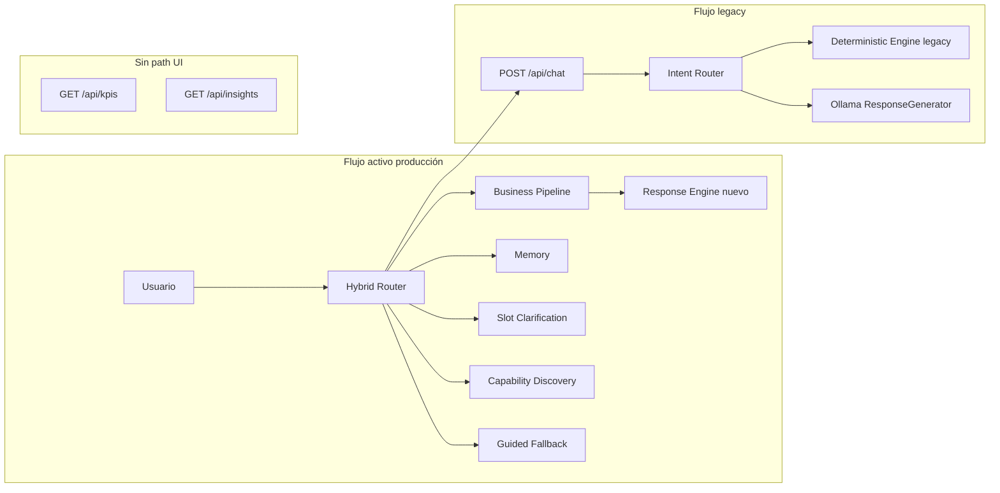

# Flow Audit — Asistente de Inteligencia Empresarial Olnatura

**Fecha:** 2026-06-23  
**Objetivo:** Mapa real del flujo actual y clasificación ACTIVO / LEGACY / OBSOLETO.

---

## Flujo principal de producción (frontend → backend)

```
Usuario (React AssistantPage)
    │
    ▼
useChatApi → chatApi.sendChatQuestion()
    │
    ├── [VITE_USE_HYBRID_CHAT=true]  POST /api/chat/hybrid
    │         │
    │         ▼
    │    HybridChatRouter.route()
    │         │
    │         ├── Conversation Memory ──► respuesta directa
    │         ├── SemanticIntentBuilder ──► BusinessQueryPlanner
    │         │         │
    │         │         ├── supported ──► Slot Clarification ──► Business Pipeline
    │         │         │                      │
    │         │         │                      ▼
    │         │         │               Query Executor + Response Engine (nuevo)
    │         │         │
    │         │         └── unsupported ──► Capability Discovery (v2)
    │         │         └── unsupported ──► Guided Fallback (v2 dominio)
    │         │         └── null ──► legacy_delegate()
    │         │
    │         └── legacy_chat ──► POST /api/chat (interno)
    │
    └── [VITE_USE_HYBRID_CHAT=false] POST /api/chat
```

**Evidencia:** `frontend/src/services/chatApi.ts`, `app/api/routes/hybrid_chat.py`, `app/services/hybrid_chat_router.py`, `app/api/deps.py` (legacy_delegate).

---

## Flujo Business Pipeline (ACTIVO)

```
Mensaje usuario
    → SemanticIntentBuilder (operation_resolver + entity_resolver)
    → BusinessQueryPlanner
    → BusinessQueryExecutor (repositories/query_executor/*)
    → DeterministicResponseEngine (response_engine/)
    → HybridChatResult + SuggestedQuestionsEngine
    → PerformanceTracker → performance_metrics (PostgreSQL)
```

| Etapa | Módulo | Estado |
|-------|--------|--------|
| Intent semántico | `semantic_intent_builder.py` | **ACTIVO** |
| Planificación | `query_engine/query_planner.py` | **ACTIVO** |
| Ejecución | `query_executor/business_query_executor.py` | **ACTIVO** |
| Respuesta | `response_engine/deterministic_response_engine.py` | **ACTIVO** |
| Sugerencias | `suggested_questions/engine.py` | **ACTIVO** |

---

## Flujo Legacy Chat (LEGACY — aún activo)

```
POST /api/chat
    → HumanLanguageLayer (spell, synonym, intent normalize)
    → EntityExtractionLayer
    → SocialIdentityLayer
    → IntentRouter.route()  [~40 intents regex]
    → DeterministicResponseEngine (services/)  OR  ResponseGenerator + Ollama
    → ChatResponse con timings
```

| Etapa | Módulo | Estado |
|-------|--------|--------|
| NLP preprocessing | `human_language_layer.py` | **LEGACY** |
| Routing por patrones | `intent_router.py` (608 líneas) | **LEGACY** |
| Respuesta determinista | `services/deterministic_response_engine.py` | **LEGACY** |
| Respuesta generativa | `response_generator.py` + `ollama_client.py` | **LEGACY** |
| Capas ejecutivas | `executive_capability_layer`, `token_optimization_layer`, etc. | **LEGACY** |

**Activación:** Directa si `USE_HYBRID_CHAT=false`; indirecta como último recurso del hybrid (`handled_by=legacy_chat`).

---

## Módulos conversacionales (ACTIVO — en hybrid)

| Módulo | Función | Estado |
|--------|---------|--------|
| `conversation_memory/` | Follow-ups y contexto de sesión | **ACTIVO** (in-process, v1) |
| `slot_clarification/` | Preguntas de aclaración | **ACTIVO** |
| `guided_fallback/` + `v2/` | Asistencia guiada + dominio | **ACTIVO** (v1+v2 coexisten) |
| `capability_discovery/` + `v2/` | "¿Qué puedes hacer?" | **ACTIVO** (v2 es formatter principal) |
| `coverage_recovery/` | Recuperación de cobertura | **ACTIVO** |

---

## APIs de diagnóstico / pipeline expuesto (EXPERIMENTAL)

Endpoints que exponen etapas del pipeline sin pasar por hybrid:

| Endpoint | Etapa expuesta | Estado |
|----------|----------------|--------|
| `GET /api/semantic/operation` | Operation resolver | **EXPERIMENTAL** |
| `GET /api/semantic/entity` | Entity resolver | **EXPERIMENTAL** |
| `GET /api/semantic/intent` | Semantic intent builder | **EXPERIMENTAL** |
| `GET /api/query/plan` | Query planner | **EXPERIMENTAL** |
| `GET /api/query/execute` | Query executor | **EXPERIMENTAL** |
| `GET /api/query/respond` | Response engine | **EXPERIMENTAL** |

Útiles para desarrollo y tests; no forman parte del flujo UI principal.

---

## Analytics y auditoría (ACTIVO — dashboards)

```
performance_metrics (PostgreSQL)
    ├── BusinessAnalyticsService → GET /api/analytics/*
    ├── OperationalAuditService → GET /api/audit/*
    └── MetricsService → GET /api/metrics/*
            │
            ▼
    Frontend: AnalyticsPage, OperationalAuditPage, PerformancePage (parcial)
```

---

## Analytics datamart legacy (LEGACY — sin UI React)

```
Fact tables + Materialized views
    → AnalyticsRepository / InsightsRepository
    → GET /api/kpis*, /api/insights*, /api/metadata
    → Solo scripts manuales (scripts/test_api.py)
```

| Componente | Estado |
|------------|--------|
| `app/api/routes/analytics.py` | **LEGACY** (API datamart) |
| `app/api/routes/insights.py` | **LEGACY** |
| `app/repositories/analytics_repository.py` | **LEGACY** (activo vía API) |
| `app/services/analytics_service.py` | **LEGACY** |

---

## Componentes históricos / obsoletos parciales

| Elemento | Clasificación | Razón |
|----------|---------------|-------|
| `ExecutiveSummaryService` | **OBSOLETO en runtime** | Reemplazado por tablas `*_resumen` + repos; solo script ETL |
| `QUICK_SUGGESTIONS` (frontend) | **OBSOLETO** | Deprecado; sustituido por sugerencias del backend |
| `PerformanceMetricsGrid`, `PerformanceHero`, `CostOptimizationSection` | **OBSOLETO en UI** | Sustituidos por secciones actuales de PerformancePage |
| Subpaquetes `v1` implícitos en guided_fallback/capability_discovery | **LEGACY interno** | v2 extiende sin eliminar v1 |
| `scripts/test_*.py` (24 archivos) | **LEGACY operativo** | Pruebas manuales del stack antiguo |

---

## Diagrama comparativo



---

## Estimación de código por clasificación

| Clasificación | Líneas Python `app/` estimadas | % del total (~11.484) |
|---------------|-------------------------------|------------------------|
| **ACTIVO** (hybrid + pipeline + observability + audit) | ~5.500–6.500 | ~48–57% |
| **LEGACY** (chat stack + datamart API) | ~3.500–4.000 | ~30–35% |
| **COMPARTIDO** (repos, models, schemas, deps) | ~1.500–2.000 | ~13–17% |
| **OBSOLETO runtime** (executive_summary_service, etc.) | ~300 | ~3% |

*Estimación basada en conteo de archivos principales; no incluye tests ni scripts.*

---

## Conclusión del mapa

El sistema opera en **modo híbrido dual**: el camino de producción preferido es `HybridChatRouter` + pipeline determinista nuevo, pero el stack `IntentRouter` + Ollama permanece como **red de seguridad activa** y como endpoint independiente. Las APIs de datamart (`/api/kpis`) son **legacy operativo** sin consumidor en el frontend React actual.
