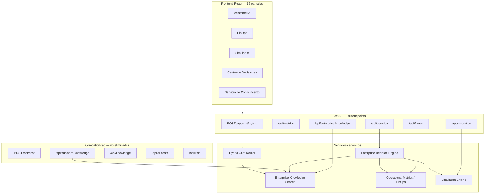

# Release Candidate 1 — Olnatura Intelligence

**Fecha de certificación:** 2026-06-23  
**Versión:** RC1  
**Alcance:** Consolidación arquitectónica sin cambio de comportamiento ni nuevas funcionalidades

---

## 1. Arquitectura final

### Fuentes únicas consolidadas

| Dominio | Fuente canónica | Facades legacy |
|---------|-----------------|----------------|
| Conocimiento runtime | `enterprise_knowledge_service` | `business_knowledge`, `knowledge_pack` |
| Métricas operativas | `observability` + `performance_metrics` (BD) | Métricas in-memory por módulo |
| Costos / FinOps | `operational_metrics` | `/api/ai-costs`, `business_analytics/financial` (delega) |
| Simulaciones | `simulation_engine` | — |
| Decisiones ejecutivas | `enterprise_decision` | — |
| Identidad producto | `product_identity` | — |
| Capacidades | `capability_discovery` v2 | v1 en path de fallback |

---

## 2. Módulos activos (37 paquetes top-level)

| # | Módulo | Rol |
|---|--------|-----|
| 1 | `ai_orchestration` | Orquestación LLM ejecutiva |
| 2 | `api` | Routers y dependencias FastAPI |
| 3 | `business_analytics` | Cobertura, rendimiento, financiero |
| 4 | `business_entity_master` | Catálogo de entidades |
| 5 | `business_entity_profile` | Perfiles de entidades |
| 6 | `business_knowledge` | **Facade** → EKS |
| 7 | `business_ontology` | Ontología empresarial |
| 8 | `capability_discovery` | Descubrimiento de capacidades |
| 9 | `canonical_business_entity` | Entidades canónicas |
| 10 | `conversation_memory` | Memoria conversacional |
| 11 | `core` | Configuración |
| 12 | `coverage_recovery` | Recuperación sin cobertura |
| 13 | `database` | Sesión SQLAlchemy |
| 14 | `domain` | Catálogos de dominio |
| 15 | `enterprise_decision` | Motor de decisiones v1 |
| 16 | `enterprise_knowledge` | EKO (objetos BD) |
| 17 | `enterprise_knowledge_service` | **EKS canónico** |
| 18 | `enterprise_reasoning` | ERO |
| 19 | `evidence_package` | EEP |
| 20 | `guided_fallback` | Fallback guiado |
| 21 | `knowledge_pack` | **Facade** API categorías |
| 22 | `models` | ORM |
| 23 | `observability` | Métricas agregadas |
| 24 | `operational_audit` | Auditoría operativa |
| 25 | `operational_metrics` | **FinOps canónico** |
| 26 | `product_identity` | Identidad del asistente |
| 27 | `query_engine` | Planificador de queries |
| 28 | `query_executor` | Ejecutor de queries |
| 29 | `repositories` | Repos datamart/analytics |
| 30 | `response_engine` | Motor determinístico v2 |
| 31 | `schemas` | DTOs compartidos |
| 32 | `semantic_intent` | Intención semántica |
| 33 | `services` | Chat híbrido, NLP, capas |
| 34 | `simulation_engine` | Simulación v1 |
| 35 | `slot_clarification` | Clarificación de slots |
| 36 | `suggested_questions` | Preguntas sugeridas |
| 37 | `utils` | Utilidades |

---

## 3. Módulos legacy (clasificación)

Ver detalle en [`legacy_modules_rc1.md`](legacy_modules_rc1.md).

| Clasificación | Cantidad | Ejemplos |
|---------------|----------|----------|
| **ACTIVO** | 28 | `hybrid_chat`, `operational_metrics`, `enterprise_knowledge_service`, `simulation_engine`, `enterprise_decision` |
| **COMPATIBILIDAD** | 7 | `business_knowledge`, `knowledge_pack`, `enterprise_knowledge` (EKO API), `chat` legacy, `analytics` datamart, `/api/ai-costs`, `services/deterministic_response_engine` |
| **CANDIDATO A ELIMINACIÓN** | 0 eliminados en RC1 | Frontend huérfanos eliminados; backend legacy conservado por compatibilidad |

---

## 4. Consolidación ejecutada en RC1

### Eliminado (sin consumidores demostrados)

| Elemento | Tipo |
|----------|------|
| `frontend/src/pages/AICostsPage.tsx` | Página React |
| `frontend/src/hooks/useAICosts.ts` | Hook |
| `frontend/src/services/aiCostsApi.ts` + test | Servicio API |
| `frontend/src/hooks/useBusinessKnowledge.ts` | Hook |
| `frontend/src/services/businessKnowledgeApi.ts` | Servicio API |
| `frontend/src/components/aiCosts/AICostPanels.tsx` | Componente |
| `frontend/src/components/performance/PerformanceHero.tsx` | Componente |
| `frontend/src/components/performance/CostOptimizationSection.tsx` | Componente |
| `frontend/src/components/performance/PerformanceMetricsGrid.tsx` | Componente |
| `QUICK_SUGGESTIONS` (constante deprecada) | Constante TS |
| `RoutingMetrics` + tipos asociados | Tipos TS huérfanos |

**Total duplicidades/huérfanos eliminados: 11 artefactos**

### Conservado por compatibilidad

- Ruta `/costos-ia` → alias de `FinOpsPage`
- APIs `/api/chat`, `/api/kpis`, `/api/ai-costs`, `/api/knowledge`
- Facades `business_knowledge/*` (tests y API activa)

### i18n consolidado (sin cambio de comportamiento)

- Escenarios del Centro de Decisiones → `spanish.ts`
- Cabeceras de tabla EEP → `spanish.ts`
- Título EEP traducido al español

---

## 5. Cobertura y pruebas

| Métrica | Valor RC1 |
|---------|-----------|
| Tests totales | **740 passed** |
| Cobertura backend (`app/`) | **87%** |
| Cobertura EDE | 94% |
| Cobertura FinOps | ~93–96% |
| Cobertura Simulation | ~93% |
| Cobertura EKS | ~91–96% |
| Tests frontend | Vitest en servicios API |

---

## 6. Limitaciones conocidas

1. Sin autenticación ni autorización
2. Sin CORS configurado explícitamente en FastAPI
3. Métricas in-memory volátiles (FinOps, simulación, decisiones, EKS)
4. Dos implementaciones de `DeterministicResponseEngine` (chat legacy vs pipeline)
5. Cuatro APIs de conocimiento superpuestas (EKS canónico + 3 facades)
6. Histórico operativo limitado sin tráfico real prolongado
7. `.env.example` contiene credenciales de ejemplo

---

## 7. Riesgos

Ver [`security_audit_rc1.md`](security_audit_rc1.md).

| Riesgo | Severidad | Mitigación RC1 |
|--------|-----------|----------------|
| API sin auth | Alta | Documentado; red interna / VPN piloto |
| Password en `.env.example` | Media | Rotar en despliegue real |
| PII en logs de chat | Media | Revisar retención antes de producción |
| Upload sin validación estricta | Media | Restringir en reverse proxy |
| Métricas volátiles | Baja | Aceptable para piloto |

---

## 8. Pendientes post-RC1

1. Pruebas funcionales con usuarios de negocio
2. Autenticación (SSO / API keys)
3. Deprecación formal de APIs legacy con período de gracia
4. Persistencia de métricas operativas en BD
5. Tests E2E frontend (Playwright/Cypress)
6. Unificación motores determinísticos
7. Configuración CORS y TLS

---

## 9. Checklist de producción

- [ ] Autenticación y RBAC implementados
- [ ] CORS restringido a dominios autorizados
- [ ] Secrets en vault (no `.env` en servidor)
- [ ] Rotación de `DATABASE_PASSWORD` y API keys LLM
- [ ] TLS terminado en reverse proxy
- [ ] Backups PostgreSQL automatizados
- [ ] Logging sin PII o con enmascaramiento
- [ ] Rate limiting en `/api/chat/hybrid`
- [ ] Health checks en orquestador (K8s/Docker)
- [ ] Métricas exportadas a Prometheus/Datadog

---

## 10. Checklist de demostración

- [x] Backend arranca en puerto 8001
- [x] Frontend arranca en puerto 5173
- [x] Asistente responde consultas empresariales
- [x] FinOps muestra costos y ahorro
- [x] Simulador ejecuta escenarios
- [x] Centro de Decisiones genera EDP
- [x] 16 pantallas accesibles desde sidebar
- [x] UI 100% español (catálogo centralizado)
- [x] 740 tests automatizados pasando

---

## 11. Checklist piloto interno

- [ ] Definir cohorte de 5–10 usuarios piloto
- [ ] Registrar consultas reales ≥ 2 semanas
- [ ] Validar FinOps con costos reales de proveedores
- [ ] Revisar recomendaciones del Centro de Decisiones con stakeholders
- [ ] Recopilar feedback de usabilidad por pantalla
- [ ] Documentar consultas no resueltas (coverage gap)
- [ ] Establecer SLA de respuesta aceptable
- [ ] Plan de rollback documentado

---

## Release Notes RC1

### Incluido

- Plataforma completa de inteligencia empresarial híbrida
- Enterprise Knowledge Service, FinOps v2, Simulation Engine v1, Enterprise Decision Engine v1
- 16 pantallas frontend en español
- 99 endpoints HTTP documentados
- 740 tests automatizados

### Consolidado en RC1

- Eliminación de 11 artefactos frontend huérfanos
- Documentación arquitectónica unificada
- Clasificación legacy sin ruptura de compatibilidad
- i18n reforzado (EEP, Centro de Decisiones)

### Sin cambios

- Lógica de negocio de todos los motores
- Comportamiento visible del asistente
- APIs legacy (siguen activas)
